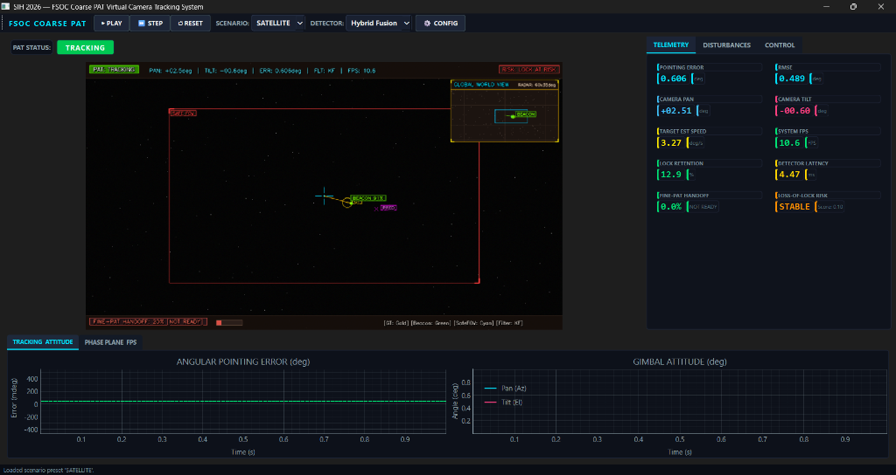

# User Manual
## FSOC Coarse PAT Simulator — Installation, Operation & Configuration Guide

**Version:** 1.0  
**Date:** September 2026  

---

## Table of Contents

1. [Introduction](#1-introduction)
2. [System Requirements](#2-system-requirements)
3. [Installation](#3-installation)
4. [Quick Start](#4-quick-start)
5. [Application Modes](#5-application-modes)
6. [GUI Description](#6-gui-description)
7. [Parameter Configuration](#7-parameter-configuration)
8. [Scenario Presets](#8-scenario-presets)
9. [Running Benchmarks](#9-running-benchmarks)
10. [Running the Demonstration](#10-running-the-demonstration)
11. [Understanding the Output Reports](#11-understanding-the-output-reports)
12. [Troubleshooting](#12-troubleshooting)

---

## 1. Introduction

The FSOC Coarse PAT Simulator is a desktop software application that simulates the Pointing, Acquisition, and Tracking (PAT) subsystem of a Free-Space Optical Communication terminal. It provides:

- A **real-time simulation** of an optical beacon tracking in a disturbed environment.
- A **Mission-Control GUI** with live camera viewport, telemetry strip-charts, and interactive controls.
- A **command-line interface** for headless benchmarking and automated testing.
- A **5-act demonstration tour** showcasing all system capabilities.

---

## 2. System Requirements

### 2.1 Hardware

| Component | Minimum | Recommended |
|---|---|---|
| CPU | Dual-core, 2.0 GHz | Quad-core, 3.0+ GHz |
| RAM | 4 GB | 8 GB |
| Display | 1280×720 | 1920×1080 or higher |
| Storage | 500 MB free | 1 GB free |
| GPU | Not required | NVIDIA GPU (for AI model inference) |

### 2.2 Software

| Dependency | Version |
|---|---|
| Operating System | Windows 10/11 (64-bit) or Ubuntu 20.04+ |
| Python | 3.9 or later |
| pip | 21.0 or later |
| Git | 2.30+ (optional, for cloning) |

---

## 3. Installation

### 3.1 Step 1 — Download the Project

If provided as a ZIP archive, extract it to your preferred directory. If using Git:

```bash
git clone <repository-url> fsoc-pat
cd fsoc-pat
```

### 3.2 Step 2 — Create a Virtual Environment (Recommended)

```bash
# Windows
python -m venv venv
venv\Scripts\activate

# Linux / macOS
python3 -m venv venv
source venv/bin/activate
```

### 3.3 Step 3 — Install Dependencies

```bash
pip install -r requirements.txt
```

This installs the following packages:

| Package | Purpose |
|---|---|
| `numpy>=1.24.0` | Array computation and linear algebra |
| `opencv-python>=4.8.0` | Image processing, detection, and rendering |
| `PySide6>=6.5.0` | Qt6-based GUI framework |
| `pyqtgraph>=0.13.0` | Real-time plotting and strip-charts |
| `matplotlib>=3.7.0` | Report chart generation |
| `ultralytics>=8.0.0` | AI YOLO model loading and inference |
| `pytest>=7.0.0` | Test execution framework |

> **Note:** `ultralytics` is optional. The system will fall back to classical-only detection if no AI model is provided.

### 3.4 Step 4 — Verify Installation

Run the test suite to confirm everything is working:

```bash
cd fsoc-pat
python -m pytest tests/ -v
```

All 23 tests should pass.

### 3.5 Step 5 — AI Model Setup (Optional)

To enable AI-based beacon detection, place a trained YOLO model file in the `models/` directory:

```
fsoc-pat/
└── models/
    └── beacon_detector.onnx   ← Place model file here
```

Supported formats:
- `.onnx` — Inferred via OpenCV DNN (no GPU required)
- `.pt` — Inferred via Ultralytics YOLO (requires PyTorch)

If no model file is present, the system will operate with classical CV detection only, which is fully functional.

---

## 4. Quick Start

### 4.1 Launch the GUI Dashboard

```bash
cd fsoc-pat
python app/main.py
```

This opens the full Mission-Control GUI with a live camera viewport, telemetry charts, and interactive disturbance controls. The simulation starts automatically.

### 4.2 Launch the CLI Preview

To run the simulation with an OpenCV viewport (lighter than the full GUI):

```bash
python app/main.py --preview
```

### 4.3 Launch Headless (No Display)

For automated benchmarking without any visual display:

```bash
python app/main.py --headless --duration 300
```

### 4.4 Run the Demonstration Tour

```bash
python demo.py
```

This runs a 5-act guided demonstration. Add `--preview` for a live viewport or use headless mode by default.

---

## 5. Application Modes

The application supports three operational modes:

### 5.1 GUI Dashboard Mode (Default)

**Launch:** `python app/main.py`

The full PySide6 Mission-Control interface with:
- Real-time camera sensor viewport with HUD overlay
- Live telemetry strip-charts (pointing error, gimbal attitude, FPS)
- Interactive disturbance control sliders
- PID gain tuning panel
- Manual gimbal jog controls
- Scenario preset selector
- Tactical overview map

### 5.2 CLI Preview Mode

**Launch:** `python app/main.py --preview`

An OpenCV-based live viewport with integrated HUD overlay. Suitable for quick validation without the full Qt GUI overhead.

### 5.3 Headless Mode

**Launch:** `python app/main.py --headless`

No display output. The simulation runs at maximum speed and generates telemetry CSV, JSON, and HTML report files. Ideal for long-duration runs and benchmark sweeps.

### Command-Line Arguments

| Argument | Description | Default |
|---|---|---|
| `--config <path>` | Path to scenario JSON configuration file | `configs/default.json` |
| `--preview` | Show OpenCV live viewport | Off |
| `--headless` | Run without any display | Off |
| `--duration <seconds>` | Simulation duration in seconds | 30 |
| `--output-dir <path>` | Directory for generated reports | `reports/` |

---

## 6. GUI Description

The FSOC Coarse PAT software features an aerospace-grade Mission-Control Dashboard built with PySide6 (Qt6) and accelerated with PyQtGraph for real-time telemetry plotting.


*Figure 6.1: Mission-Control GUI Dashboard during an active satellite tracking pass (`SATELLITE`), highlighting the primary camera sensor viewport with tactical HUD overlay, inset global world radar, live telemetry KPI cards, and dual-axis attitude strip-charts.*

### 6.1 Main Window Architecture

The interface is structured into four primary operational zones:

1. **Top Command & Control Toolbar:** Quick-access controls for simulation playback (`PLAY`, `STEP`, `RESET`), scenario selection, detector selection, configuration dialogs, and real-time PAT status badge.
2. **Primary Camera Viewport (Upper Left):** Live simulated optical sensor feed with synthetic starfield, dynamic target tracking overlays, HUD telemetry, and picture-in-picture Tactical World Radar.
3. **Telemetry & Control Sidebar (Right Side):** Multi-tab operational console housing:
   - **`TELEMETRY` Tab:** 10 real-time KPI metric badges providing instantaneous error, RMSE, gimbal coordinates, target velocity, frame rate, latency, and handoff readiness.
   - **`DISTURBANCES` Tab:** Interactive sliders to inject sensor noise, platform vibration, atmospheric turbulence, and motion blur dynamically.
   - **`CONTROL` Tab:** Live dual-axis PID tuning (`Kp`, `Ki`, `Kd`, dead-zone) and manual gimbal jog controls.
4. **Strip-Chart Analysis Deck (Bottom):** Multi-tabbed real-time graphing strip (`TRACKING ATTITUDE`, `PHASE PLANE`, `FPS`) plotting radial error and dual-axis gimbal angles against time.

---

### 6.2 Top Command & Control Toolbar

| Element | Type | Function |
|---|---|---|
| **System Badge** | Logo | Identifies the subsystem (`FSOC COARSE PAT`). |
| **`▶ PLAY` / `⏸ PAUSE`** | Button | Starts and pauses the simulation loop worker thread. |
| **`⏭ STEP`** | Button | Advances simulation execution by a single discrete frame ($\Delta t$). |
| **`↺ RESET`** | Button | Re-initialises the current scenario, camera attitude, and state machine. |
| **`SCENARIO: [Preset ▼]`** | Dropdown | Hot-swaps scenarios on the fly (`DEFAULT`, `EASY`, `UAV`, `SATELLITE`, `EXTREME`). |
| **`DETECTOR: [Pipeline ▼]`** | Dropdown | Selects active detection backend (`Classical CV`, `YOLO AI`, or `Hybrid Fusion`). |
| **`⚙ CONFIG`** | Button | Opens advanced configuration modal to inspect and edit JSON parameters. |
| **`PAT STATUS: [STATE]`** | Pill Badge | High-visibility status indicator colour-coded by lifecycle state (e.g. `TRACKING` in bright green, `LOCKED` in cyan, `LOST` in red). |

---

### 6.3 Camera Viewport & HUD Overlay

The primary viewport renders the 60 Hz optical sensor view with a comprehensive HUD overlay:

| HUD Element | Visual Appearance | Description |
|---|---|---|
| **Top Status Header** | Text strip (cyan/white) | Readout showing current PAT state, Gimbal Pan/Tilt angles, instantaneous error (`ERR: 0.606deg`), active filter mode (`FLT: KF` or `FLT: PF`), and loop frame rate (`FPS: 10.6`). |
| **Risk Warning Badge** | Box (top-right, red/yellow) | Dynamic `RISK: LOCK AT RISK` or `RISK: STABLE` alert computed by the Safe FOV engine. |
| **Tactical World Radar** | Picture-in-Picture inset (top-right) | Panoramic $60^\circ \times 35^\circ$ map of the celestial sphere (`GLOBAL WORLD VIEW`), displaying the true beacon location, full trajectory trail, and the camera's moving FOV footprint. |
| **Boresight Reticle** | Cyan crosshair | Marks the exact optical boresight axis (centre of sensor frame). |
| **Safe FOV Boundary** | Rectangular boundary box | Dynamic safe-margin boundary computed from target velocity and platform jitter; alerts if target risks escaping sensor FOV. |
| **Beacon Detection Box** | Green rectangle with label | Encloses the detected beacon spot with confidence percentage (e.g. `BEACON 91%`). |
| **Ground-Truth Indicator** | Gold circle & vector line | Ground-truth beacon centroid with a connecting line pointing to boresight to visualise instantaneous offset. |
| **Lead-Ahead Prediction** | Magenta cross (`[PRED]`) | Kalman-predicted beacon intercept point $H$ frames into the future to counteract motor transport latency. |
| **Fine-PAT Handoff Bar** | Progress bar (bottom-left) | Shows handoff readiness percentage (e.g. `FINE-PAT HANDOFF: 20% [NOT READY]`). |
| **HUD Legend** | Bottom-right text | Colour key: `[GT: Gold] [Beacon: Green] [SafeFOV: Cyan] [Filter: KF]`. |

---

### 6.4 Telemetry Sidebar (Tab 1: `TELEMETRY`)

The Telemetry panel organizes critical flight parameters into 10 high-contrast HUD cards:

| Metric Card | Unit | Description |
|---|---|---|
| **`[POINTING ERROR]`** | degrees / mdeg | Instantaneous angular distance between camera optical axis and beacon. |
| **`[RMSE]`** | degrees | Cumulative Root-Mean-Square Error over the tracking epoch. |
| **`[CAMERA PAN]`** | degrees | Current azimuth angle of the gimbal relative to home ($\alpha$). |
| **`[CAMERA TILT]`** | degrees | Current elevation angle of the gimbal relative to home ($\varepsilon$). |
| **`[TARGET EST SPEED]`** | deg/s | Kalman-estimated target angular velocity norm ($\|\mathbf{v}\| = \sqrt{\dot{\alpha}^2 + \dot{\varepsilon}^2}$). |
| **`[SYSTEM FPS]`** | FPS | Actual achieved end-to-end simulation and rendering frame rate. |
| **`[LOCK RETENTION]`** | % | Percentage of simulation time spent in the `LOCKED` state. |
| **`[DETECTOR LATENCY]`** | ms | Execution latency of the vision detection and fusion pipeline per frame. |
| **`[FINE-PAT HANDOFF]`** | % / State | Handoff readiness score (0–100%) and eligibility badge (`READY` / `STABILIZING` / `NOT READY`). |
| **`[LOSS-OF-LOCK RISK]`** | State / Score | Dynamic risk state (`STABLE`, `WARNING`, `LOCK AT RISK`, `CRITICAL`) and numeric risk index (0.00–1.00). |

---

### 6.5 Interactive Control Panels (Tabs 2 & 3)

#### Tab 2: `DISTURBANCES`
Allows real-time injection of environmental stress factors during active simulation:
- **Sensor Noise Slider (0–100%):** Injects Gaussian photon noise and dark-current pixel defects into the sensor frame.
- **Platform Vibration Slider (0–100%):** Simulates high-frequency angular jitter from UAV rotor dynamics or spacecraft reaction wheels.
- **Atmospheric Turbulence Slider (0–100%):** Injects spatial optical warp fields and intensity scintillation ($C_n^2$ scaling).
- **Motion Blur Slider (0–100%):** Convolves sensor frames with dynamic directional motion blur kernels.
- **Dynamic Occluder Trigger:** Simulates moving line-of-sight obstructions (clouds, debris) to test Kalman dead-reckoning coasting.

#### Tab 3: `CONTROL`
- **PID Gain Tuning:** Live sliders to modify $K_p$, $K_i$, and $K_d$ independently for both azimuth and elevation axes.
- **Dead-Zone Configuration:** Adjusts the tolerance region ($\theta_{\text{dead}}$) to eliminate actuator chatter while locked.
- **Manual Jog Interface:** Directional keypad (`▲`, `▼`, `◄`, `►`, and `Centre`) to manually slew the gimbal.

---

### 6.6 Strip-Chart Analysis Deck

The bottom analytical section provides continuous real-time telemetry strip-charts powered by PyQtGraph:

- **`TRACKING ATTITUDE` Tab (Dual Charts):**
  - **Left Chart (`ANGULAR POINTING ERROR`):** Radial pointing error in degrees versus simulation time, featuring a dashed green horizontal reference line representing the fine lock threshold.
  - **Right Chart (`GIMBAL ATTITUDE`):** Continuous time history of gimbal orientation, plotting Pan/Azimuth in cyan and Tilt/Elevation in magenta.
- **`PHASE PLANE` Tab:** 2D phase-space trajectory ($\dot{e}$ vs. $e$) displaying orbital convergence and limit cycles.
- **`FPS` Tab:** End-to-end loop frame rate and detector inference latency over time.

---

## 7. Parameter Configuration

### 7.1 Configuration File Format

The system is configured via JSON files in the `configs/` directory. The structure is:

```json
{
  "world": {
    "width_deg": 60.0,
    "height_deg": 35.0,
    "background_type": "starfield",
    "star_density": 0.002,
    "ambient_light": 10
  },
  "camera": {
    "resolution": [1280, 720],
    "fov_horizontal_deg": 20.0,
    "fov_vertical_deg": 11.25,
    "pan_limits_deg": [-45.0, 45.0],
    "tilt_limits_deg": [-25.0, 25.0],
    "max_pan_speed_deg_s": 25.0,
    "max_tilt_speed_deg_s": 25.0,
    "fps": 30.0
  },
  "beacon": {
    "id": 1,
    "name": "primary_optical_beacon",
    "initial_pos_deg": [2.0, 1.5],
    "intensity": 255,
    "radius_pixels": 7.0,
    "trajectory": {
      "type": "sinusoidal",
      "vx_deg_s": 1.2,
      "vy_amplitude_deg": 2.5,
      "vy_frequency_hz": 0.15
    },
    "distractors": [ ... ]
  },
  "detection": {
    "detector_type": "classical",
    "binary_threshold": 160,
    "min_area": 6.0,
    "max_area": 1200.0,
    "min_circularity": 0.55
  },
  "pid": {
    "kp_pan": 1.1,
    "ki_pan": 0.04,
    "kd_pan": 0.18,
    "dead_zone_deg": 0.04
  },
  "tracking": {
    "prediction_horizon_steps": 5,
    "uncertainty_timeout_steps": 10,
    "loss_timeout_steps": 25
  },
  "disturbances": {
    "sensor_noise_std": 0.0,
    "vibration_amplitude_deg": 0.0,
    "turbulence_strength": 0.0,
    "motion_blur_kernel_size": 0,
    "frame_drop_prob": 0.0
  }
}
```

### 7.2 Parameter Reference

#### World Parameters

| Parameter | Type | Description |
|---|---|---|
| `width_deg` | float | Angular width of the world (degrees) |
| `height_deg` | float | Angular height of the world (degrees) |
| `background_type` | string | Background rendering type: `"starfield"` or `"black"` |
| `star_density` | float | Density of background stars (stars per pixel) |
| `ambient_light` | int | Background illumination level (0–255) |

#### Camera Parameters

| Parameter | Type | Description |
|---|---|---|
| `resolution` | [int, int] | Sensor resolution in pixels [width, height] |
| `fov_horizontal_deg` | float | Horizontal field of view in degrees |
| `fov_vertical_deg` | float | Vertical field of view in degrees |
| `pan_limits_deg` | [float, float] | Azimuth hard-stop limits [min, max] |
| `tilt_limits_deg` | [float, float] | Elevation hard-stop limits [min, max] |
| `max_pan_speed_deg_s` | float | Maximum azimuth slew rate (°/s) |
| `max_tilt_speed_deg_s` | float | Maximum elevation slew rate (°/s) |
| `fps` | float | Sensor frame rate (Hz) |

#### Beacon Parameters

| Parameter | Type | Description |
|---|---|---|
| `initial_pos_deg` | [float, float] | Initial position [azimuth, elevation] in degrees |
| `intensity` | int | Beacon brightness (0–255) |
| `radius_pixels` | float | Beacon PSF radius in pixels |
| `trajectory.type` | string | Motion type: `"linear"`, `"circular"`, `"sinusoidal"`, `"maneuver"` |

#### PID Parameters

| Parameter | Type | Default | Description |
|---|---|---|---|
| `kp_pan` | float | 1.1 | Proportional gain (azimuth) |
| `ki_pan` | float | 0.04 | Integral gain (azimuth) |
| `kd_pan` | float | 0.18 | Derivative gain (azimuth) |
| `kp_tilt` | float | 1.1 | Proportional gain (elevation) |
| `ki_tilt` | float | 0.04 | Integral gain (elevation) |
| `kd_tilt` | float | 0.18 | Derivative gain (elevation) |
| `dead_zone_deg` | float | 0.04 | Dead-zone in degrees |
| `derivative_filter_alpha` | float | 0.75 | Low-pass filter on D-term (0–1) |

#### Tracking Parameters

| Parameter | Type | Default | Description |
|---|---|---|---|
| `prediction_horizon_steps` | int | 5 | Number of frames for Kalman lead-ahead prediction |
| `uncertainty_timeout_steps` | int | 10 | Frames before transitioning from UNCERTAIN to LOST |
| `loss_timeout_steps` | int | 25 | Frames before triggering full reacquisition search |
| `gate_threshold_deg` | float | 1.5 | Chi-square innovation gate radius (degrees) |

#### Disturbance Parameters

| Parameter | Type | Range | Description |
|---|---|---|---|
| `sensor_noise_std` | float | 0.0–50.0 | Gaussian noise standard deviation (pixel intensity) |
| `vibration_amplitude_deg` | float | 0.0–2.0 | Platform vibration amplitude (degrees) |
| `vibration_frequency_hz` | float | 0.0–50.0 | Platform vibration frequency (Hz) |
| `turbulence_strength` | float | 0.0–1.0 | Atmospheric turbulence intensity (normalised) |
| `motion_blur_kernel_size` | int | 0–31 | Motion blur convolution kernel size (pixels) |
| `frame_drop_prob` | float | 0.0–1.0 | Probability of a sensor frame being dropped |

---

## 8. Scenario Presets

### 8.1 Easy Scenario

**Config:** `configs/easy.json`

Low-difficulty scenario for initial familiarisation.
- Target: Slow circular trajectory (~1°/s)
- Disturbances: None (clean channel)
- Expected: Rapid acquisition, stable LOCKED state, near-zero error

```bash
python app/main.py --config configs/easy.json
```

### 8.2 UAV Scenario

**Config:** `configs/uav.json`

Moderate scenario simulating an airborne optical terminal.
- Target: Sinusoidal drift at 1.5°/s
- Disturbances: 12% noise, 15% vibration, 15% turbulence
- Expected: Tracking with occasional DEGRADED state transitions

```bash
python app/main.py --config configs/uav.json
```

### 8.3 Satellite Scenario

**Config:** `configs/satellite.json`

Simulates a LEO satellite optical downlink.
- Target: Linear pass at 2°/s
- Disturbances: 8% noise, 10% vibration
- Expected: Continuous tracking with lead-ahead prediction active

```bash
python app/main.py --config configs/satellite.json
```

### 8.4 Extreme Scenario

**Config:** `configs/extreme.json`

Maximum-difficulty scenario for stress testing.
- Target: Maneuver trajectory with random jinking + distractor objects
- Disturbances: 20% noise, 20% vibration, 25% turbulence, 15% motion blur
- Expected: Intermittent LOST/REACQUIRING cycles, PF engagement likely

```bash
python app/main.py --config configs/extreme.json
```

### 8.5 Creating Custom Scenarios

Copy any existing configuration file and modify parameters:

```bash
cp configs/default.json configs/my_scenario.json
```

Edit `my_scenario.json` in any text editor, then launch:

```bash
python app/main.py --config configs/my_scenario.json
```

---

## 9. Running Benchmarks

### 9.1 Multi-Algorithm Benchmark

Compare all five algorithm configurations across scenarios:

```bash
python demo.py --benchmark
```

This runs each algorithm (A through E) on each scenario and generates:
- Per-algorithm CSV telemetry
- Comparative JSON summary
- HTML performance report with charts

### 9.2 Survival Envelope Analysis

Generate the 2D capability envelope matrix:

```bash
python -m evaluation.survival_envelope
```

Outputs:
- Lock retention matrix (target velocity vs. turbulence)
- Safe operational boundary summary
- Adversarial failure points discovered

### 9.3 Custom Benchmark Run

```bash
python app/main.py --headless --duration 120 --config configs/satellite.json --output-dir reports/satellite_test/
```

---

## 10. Running the Demonstration

### 10.1 Full Demonstration Tour

The 5-act demonstration showcases all system capabilities in sequence:

```bash
python demo.py
```

Or with a live viewport:

```bash
python demo.py --preview
```

### 10.2 Act Descriptions

| Act | Duration | Demonstrates |
|---|---|---|
| Act 1 — Acquisition & Search | ~5 s | Spiral scan, candidate detection, M-of-N verification, lock convergence |
| Act 2 — Dynamic Tracking | ~8 s | Sinusoidal target, Kalman prediction, lead-ahead control |
| Act 3 — Turbulence Survival | ~6 s | Turbulence injection, vibration, hybrid KF ↔ PF, Safe FOV risk |
| Act 4 — Occlusion Recovery | ~5 s | Dynamic occluder, dead-reckoning coast, reacquisition |
| Act 5 — Handoff Readiness | ~5 s | Error convergence, handoff score evaluation |

### 10.3 Demonstration Outputs

Each act generates:
- `act_X_telemetry.csv` — Per-frame telemetry data
- `act_X_summary.json` — Performance summary KPIs
- `final_performance_report.html` — Comprehensive HTML report
- Console narration with real-time performance metrics

---

## 11. Understanding the Output Reports

### 11.1 HTML Performance Report

Generated in the `reports/` directory after each run. Contains:

- **Executive Summary:** Duration, frame count, RMSE, lock retention rate
- **Error Timeline Chart:** Pointing error over the entire simulation
- **Gimbal Attitude Chart:** Pan/tilt angles with ground truth overlay
- **KPI Scorecard:** All quantitative metrics in a formatted table
- **Per-Act Breakdown:** (Demonstration mode only) Individual act results

### 11.2 Telemetry CSV

Each row represents one simulation frame with columns:

| Column | Description |
|---|---|
| `sim_time` | Simulation timestamp (seconds) |
| `ground_truth_az_deg` | True beacon azimuth (degrees) |
| `ground_truth_el_deg` | True beacon elevation (degrees) |
| `camera_pan_deg` | Camera pan angle (degrees) |
| `camera_tilt_deg` | Camera tilt angle (degrees) |
| `pointing_error_deg` | Radial pointing error (degrees) |
| `is_locked` | Whether the system is in LOCKED state |
| `pat_state` | Current PAT FSM state name |
| `detector_latency_ms` | Detection pipeline latency (ms) |
| `fps` | Frame rate (Hz) |

### 11.3 JSON Summary

A structured JSON file containing all computed performance metrics. Can be loaded programmatically for further analysis:

```python
import json
with open("reports/summary.json") as f:
    metrics = json.load(f)
print(f"RMSE: {metrics['rmse_deg']:.4f} deg")
```

---

## 12. Troubleshooting

### 12.1 Common Issues

| Issue | Cause | Solution |
|---|---|---|
| `ModuleNotFoundError: No module named 'PySide6'` | Dependencies not installed | Run `pip install -r requirements.txt` |
| `ModuleNotFoundError: No module named 'simulation'` | Wrong working directory | `cd` to the `fsoc-pat/` root directory |
| GUI window is blank or black | GPU driver issue with Qt | Add `QT_QUICK_BACKEND=software` environment variable |
| Very low FPS (< 5) | CPU-bound rendering | Use `--headless` mode or close other applications |
| AI detector shows "fallback mode" | No model file found | Place `.onnx` or `.pt` file in `models/` directory |
| `TypeError` in trajectory code | Degree/radian mismatch | Ensure config uses degrees for all `_deg` parameters |
| OpenCV encoding errors on Windows | Unicode characters in output | Terminal encoding issue; ensure UTF-8 terminal |
| `qt.qpa.plugin: Could not find the Qt platform plugin` | Qt platform missing | Install `libgl1-mesa-glx` (Linux) or reinstall PySide6 |

### 12.2 Performance Optimisation Tips

1. **Use headless mode** for batch benchmarking — eliminates rendering overhead.
2. **Reduce camera resolution** in the config file for faster simulation.
3. **Disable AI detector** if not needed — classical CV is significantly faster.
4. **Close other applications** to free CPU resources for the simulation loop.
5. **Lower the FPS** target in the config to reduce per-second computation load.

### 12.3 Getting Help

- Review the demonstration tour: `python demo.py --preview`
- Read the Technical Report: `docs/TECHNICAL_REPORT.md`
- Run the test suite for diagnostics: `python -m pytest tests/ -v --tb=short`
- Check console output for `[INFO]`, `[WARN]`, and `[ERROR]` messages

---

> **End of User Manual**
